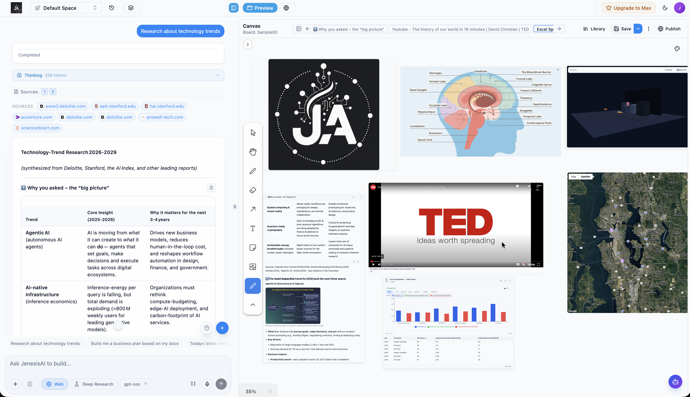
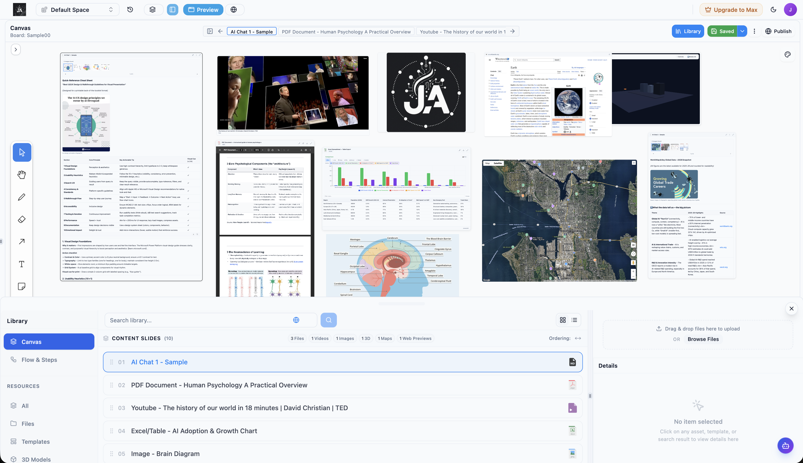
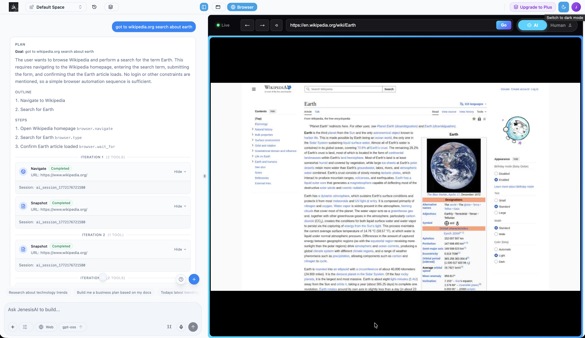
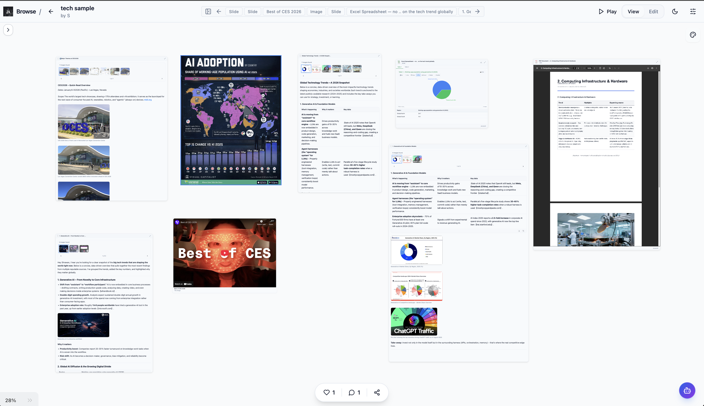

# JenesisAI

<p align="center">
  <strong>The visual workspace where humans interact with AI</strong>
</p>

<p align="center">
  <a href="https://www.jenesisai.org">Website</a> •
  <a href="https://app.jenesisai.org">Get Started Free</a> •
  <a href="https://www.youtube.com/watch?v=ZFH5QsQWB4E">Watch Demo</a> •
  <a href="https://x.com/jenesisai">X</a> •
  <a href="https://www.linkedin.com/company/jenesisai/">LinkedIn</a>
</p>

---

Most AI tools give you **answers**. **JenesisAI** gives you a **workspace**—one-prompt boards, universal multi-media, and shared workflows on a single visual canvas. Research, build, and share as naturally as you think.

## ▶️ See it in action

**[Watch the JenesisAI Launch Demo](https://www.youtube.com/watch?v=ZFH5QsQWB4E)**

[](https://www.youtube.com/watch?v=ZFH5QsQWB4E)

*One prompt → full research boards, live agents, and a visual canvas—all in one place.*

---

## Why JenesisAI?

| | **Traditional AI tools** | **JenesisAI** |
|---|---------------------------|---------------|
| **Output** | Single answers, chat threads | Visual boards: cards, slides, maps, code |
| **Research** | Copy-paste between tools | Agents search, cite, and lay out on one canvas |
| **Creation** | Export to separate apps | Build presentations, reports, and plans on the same surface |
| **Collaboration** | Share links or docs | Real-time shared boards with AI assisting everyone |

Built for **researchers**, **developers**, and **creators** who want to move as fast as their thoughts.

---

## Features

- **One-prompt boards** — Type what you want to learn; AI builds your full research board in real time with sources and structure.
- **Universal multi-media** — Documents, web links, 3D models, interactive maps on one canvas. Turn research into presentations and plans visually.
- **Shared workflows** — Collaborate in real time. Everyone edits the same board while AI assists each person.
- **Best AI, auto-routed** — GPT-4o, Gemini, Claude: tasks route to the right model, or you choose per query.
- **Live agents** — Browser control, code execution, and extensible plugins so agents act on your behalf.
- **One-click sharing** — Publish boards as shareable links or export to documents.

---

## Screenshots

| Workspace & research | Boards & canvas |
|---------------------|-----------------|
|  |  |
|  |  |

*Research meets creation: conversational AI + visual canvas, from question to finished output.*

---

## Tech stack

This **landing site** is built with:

- **Framework:** [Next.js 15](https://nextjs.org/) (App Router)
- **UI:** [React 19](https://react.dev/), [Tailwind CSS](https://tailwindcss.com/), [Radix UI](https://www.radix-ui.com/)
- **Deployment:** GitHub Actions → AWS Amplify (see [`.github/workflows/deploy.yml`](.github/workflows/deploy.yml))

The **JenesisAI platform** (app.jenesisai.org) is a separate codebase.

---

## Live links

| | |
|---|---|
| **Landing** | [jenesisai.org](https://www.jenesisai.org) |
| **App** | [app.jenesisai.org](https://app.jenesisai.org) |
| **LinkedIn** | [jenesisai](https://www.linkedin.com/company/jenesisai/) |

---

## Run the landing site locally

Requires **Node.js 18+**.

```bash
git clone https://github.com/Jenesis-Lab/jenesisai-landing.git
cd jenesisai-landing
npm install
npm run dev
```

Open [http://localhost:3000](http://localhost:3000).

---

## License

Proprietary. © 2026 JenesisAI. All rights reserved.

---

<p align="center">
  <a href="https://app.jenesisai.org"><strong>Get started free</strong></a> — Now available to the public.
</p>
